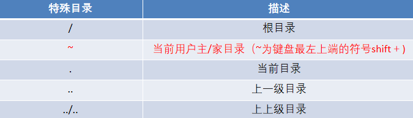

---

# Linux

## 简介：

- 安全性方面，Linux系统具有开源性，对外部任何攻击都能溯源，所以作为开发人员的首选。开放性：多用户多任务

- 什么是Makefile：对EDA工具的指导文件，对EDA工具实行的时候就会参考到Makefile（TCL写）文件
- 版本控制：**SVN**/GIT ——Linux系统中实对版本的控制，实现时间与空间的双重check。一般来说，从SVN上拷贝文件下来使用，不向上传输文件
- Linux即使关闭，后台任然可运行代码

## Terminal界面操作

- 缩放界面大小：ctrl + 减号、ctrl + shift +  加号
- 打开新的Terminal：ctrl + shift + N
- 在当前terminal下开启多个**标签页**，Alt + 数字切换标签页

## 指令含义

- "==~==" 代表家目录，"==/==" 代表根目录（系统上的，也就是云端目录）
- pwd 显示当前目录的路径（绝对路径）
- 
- 进入**项目库**：在terminal直接输入该项目库的名称

### **cd**  

绝对路径：从根目录“/”开始，描述文件在磁盘位置的方法。

- cd / 进入根目录
- **cd..**  上一级目录
- **cd ~** 切换到当前用户的 **家目录**
- cd -（减号）切换到上次访问的目录
- 注：空格的个数不影响执行命令,但是必须要有至少一个空格
- 最后的/可以省略,但是文件中间的/不可以省略
- cd ../ 上一级路径下的某个文件/文件夹

相对路径：从当前位置出发，描述到达目标文件的位置方法。

### ls

- ls 查看当前目录下的目录和文件

- ls -a 查看当前目录下包含隐藏文件在内的目录和文件
- ls -l 列表查看当前目录下所有文件和信息，包括查看文件操作权限等
- ls dir 查看指定目录下的所有目录和文件
  - ls dir ./download ： 查看当前路径下download这个文件下的所有内容

### 常用参数：

- -a 查看所有文件，包括隐藏文件
- -R 列出所有内容，包括子目录

### **创建目录/文件的方法**

#### 创建目录：

​	mkdir = make directory

- mkdir text 含义：在当前目录下创建名为text的目录
- mkdir 路径/text1含义：在指定路径下创建名为text1的目录

#### 创建文件：

​	touch 打开方式为Gvim/vim

- touch day01：在当前目录下创建
- touch 文件1 文件2：创建多个文件

### **删除和移动指令**

#### 删除rm -rf 

- rm day01 删除当前路径下的...
- rm day01 day02
- rm -f day01 删除无询问
- rm -r text1：递归（挨个）删除当前路径下的目录text1
- **==rm -rf 文件/目录==**：递归强制删除当前路径下的text1

### **修改 / 复制  mv/cp**

- mv（重命名和移动剪切）
  - mv     目录1/文件1   目录2/文件2
- cp -r 目录1  目录2 ：将文件夹1复制到文件夹2中
  - 注意：使用cp时一定要有**两个目标参数**，
  - cp -r即可复制目录也可文件

### **显示目录结构**tree

- tree 目标目录路径 以树形方式显示目录结构

- **tree -C** 目标目录路径 为显的目录结构文件类型**添加配色**（**C大写**）

---

## **一些常用的快捷键**

- **鼠标中键：**选中要复制的命令，自动复制到光标所在位置

- ctrl + c：中止进程，可配合ctrl+l使用，中止+清屏

- ### 结束后台进程：在家目录输入ps，然后kill+对应的PID

---

## SVN

SVN是subversion的缩写，是一个开放源代码的版本控制系统，用于多个人共同开发同一个项目，实现共享资源，实现最终集中式的管理。

- cd units，然后输入svn up

- **svn up：从服务器上更新到最新版本**

  后⾯可省略文件或目录名，如果省略则默认将当前⽬录以及⼦⽬录下的所有内容都更新

- svn add/delete + 目录名 / 文件名：将自己写好的文件/目录上传/删除到服务器上

- svn ci/commit + 文件夹名/文件名：**向服务器提交操作**

  注：

  - 1.每执行完一次add或者delete操作后，==**都得commit一次**==（非常重要）。但有些情况权限被禁止除外  

  - 2.SVN删除只是在本地进行删除了，但是在云端服务器上依旧存在你的所有修改的版本。

---

## Others

- cd~ 家目录下ls -a有一个隐藏文件，“==.cshrc==”，该文件为用户对Linux的独特的配置文件

​	
