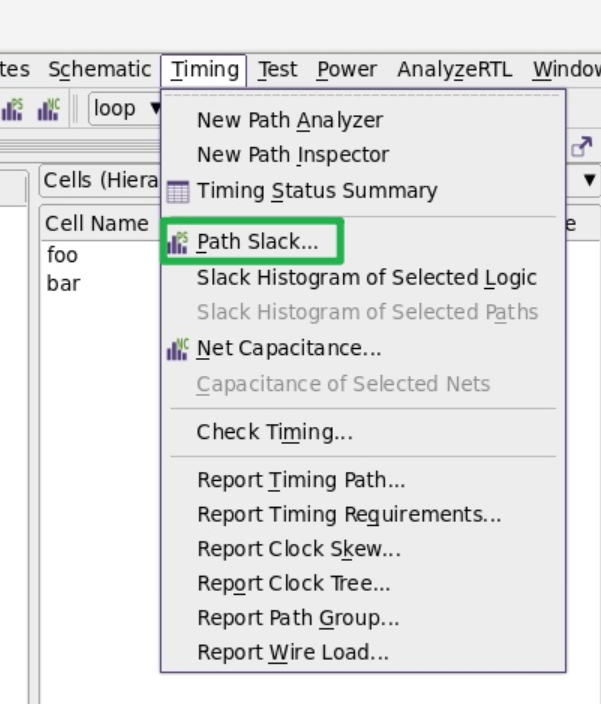
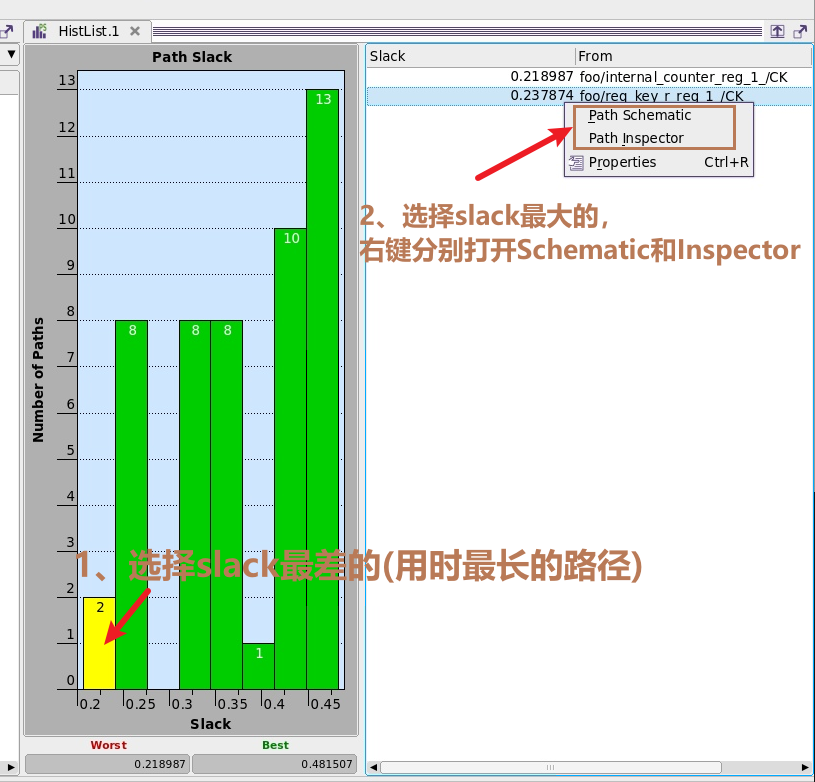
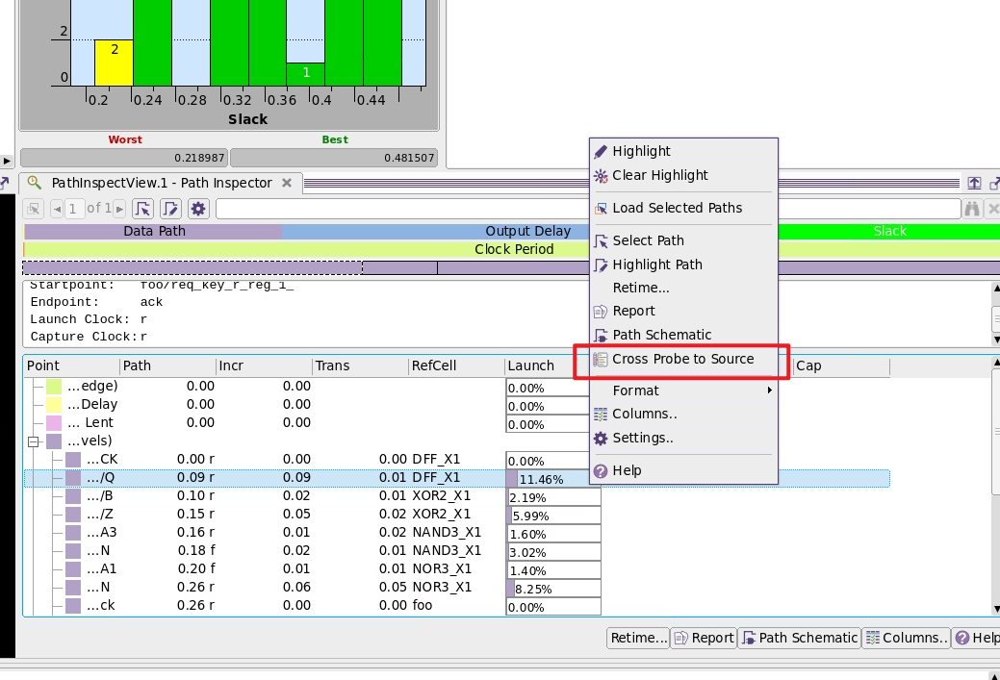
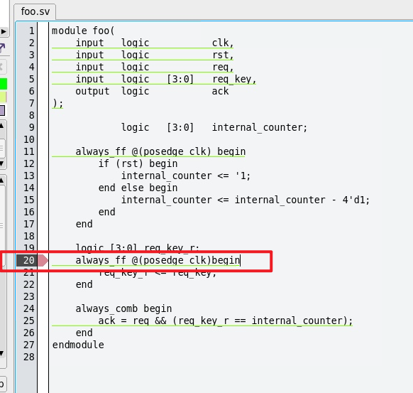

```
---
layout: post
title:  "411知识总结"
date:   2024-9-09 14:09:10 +0700
tags:
  - Others


---
```

关于MP_ Design Vision


**Design Vision**







找到对应的单元，然后进行优化



优化Delay的两种方法：

- 两个combinational logic之间均匀分布 
- 在combinational logic之间pipleline（加reg）